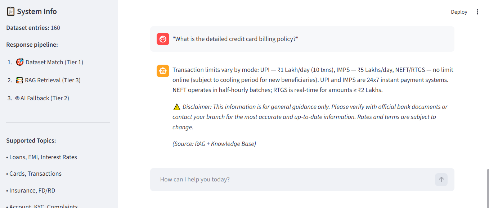

# 🏦 BFSI Call Center AI Assistant

A **secure, compliant, and lightweight** AI assistant built for Banking, Financial Services & Insurance (BFSI) call centers. Designed to run **100% locally** on modest hardware with **no GPU required**.

[](https://python.org)
[](https://streamlit.io)
[](LICENSE)

---

## 📸 Demo

<p align="center">
  
</p>

---

## ✨ Features

- 🎯 **Dataset-First Responses** — 160+ curated Alpaca-format Q&A pairs ensure accurate, compliant answers
- 📚 **RAG Retrieval** — Retrieves context from policy documents for complex financial/regulatory queries
- 🤖 **Lightweight SLM** — Template-based engine covering 15 BFSI categories — zero GPU, instant responses
- 🛡️ **Safety Guardrails** — Out-of-domain rejection, unsafe query blocking, compliance disclaimers
- 🔒 **Privacy-First** — All processing happens locally, no data leaves your machine

---

## 🏗️ Architecture

```
User Query
    │
    ▼
┌─────────────────────────┐
│  Tier 1: Dataset Match  │  Semantic similarity (threshold ≥ 0.70)
│  (160+ Alpaca samples)  │──── Match found ───► Return verified response
└──────────┬──────────────┘
           │ No match
           ▼
┌─────────────────────────┐
│  Tier 3: RAG Retrieval  │  Complex query? Search policy documents
│  (Knowledge Base)       │──── Context found ──► Grounded response
└──────────┬──────────────┘
           │ No context / simple query
           ▼
┌─────────────────────────┐
│  Tier 2: SLM Engine     │  Template-based with guardrails
│  (15 BFSI categories)   │──── Generate compliant response
└─────────────────────────┘
```

---

## 📂 Project Structure

```
Call_center_ass/
├── 📁 data/
│   └── policy_document.txt                    # Knowledge base for RAG
├── 📁 src/
│   ├── app.py                                 # Streamlit UI (main entry point)
│   ├── rag_engine.py                          # RAG engine (numpy + sentence-transformers)
│   ├── model_engine.py                        # SLM engine (templates + guardrails)
│   ├── create_dataset.py                      # Dataset generation script
│   └── train_slm.py                           # Fine-tuning script (optional, needs GPU)
├── bfsi_alpaca_1_to_160_final_clean.json      # 160 Alpaca-formatted BFSI samples
├── requirements.txt                           # Just 5 lightweight dependencies
├── run_app.bat                                # One-click launcher (Windows)
└── README.md
```

---

## 🚀 Quick Start

### Prerequisites
- Python 3.10+
- pip

### Installation

```bash
# Clone the repository
git clone https://github.com/yourusername/BFSI-Call-Center-AI-Assistant.git
cd BFSI-Call-Center-AI-Assistant

# Create virtual environment
python -m venv .venv

# Activate (Windows)
.venv\Scripts\activate
# Activate (Linux/Mac)
# source .venv/bin/activate

# Install dependencies (only 5 packages!)
pip install -r requirements.txt
```

### First Run

```bash
# Step 1: Build the RAG vector store (one-time setup)
python src/rag_engine.py

# Step 2: Launch the application
streamlit run src/app.py
```

Or simply double-click **`run_app.bat`** on Windows.

---

## 💬 Supported Query Categories

| Category | Example Queries |
|----------|----------------|
| 🏠 **Loans** | Eligibility, application process, required documents, prepayment |
| 💰 **EMI** | Calculation formula, schedules, advance payment options |
| 📈 **Interest Rates** | FD, RD, savings account, loan rates |
| 💳 **Cards** | Block/unblock, international usage, PIN reset |
| 🔄 **Transactions** | UPI, NEFT, RTGS, IMPS limits and timings |
| 🏥 **Insurance** | Policies, claims, premiums, coverage details |
| 🏦 **Accounts** | Open/close, balance inquiry, statements, KYC |
| 📱 **Digital Banking** | Mobile banking, net banking, registration |
| 📋 **Complaints** | Grievance redressal, escalation, ombudsman |
| 🏢 **Branch Info** | Working hours, locations, services |

---

## 🛡️ Safety & Compliance (Guardrails)

| Guardrail | Description |
|-----------|-------------|
| ✅ **No fabricated data** | All financial figures come from verified templates |
| ✅ **No fake rates** | Interest rates and policies sourced from knowledge base only |
| ✅ **Out-of-domain rejection** | Non-BFSI queries (weather, sports, etc.) are politely declined |
| ✅ **Unsafe query blocking** | Malicious queries (hacking, fraud) are immediately blocked |
| ✅ **Compliance disclaimers** | Auto-appended to all financial responses |
| ✅ **100% local processing** | No external API calls — all data stays on your machine |

---

## 🔧 Technical Stack

| Component | Technology | Purpose |
|-----------|-----------|---------|
| **Embeddings** | `sentence-transformers` (all-MiniLM-L6-v2, ~80MB) | Semantic similarity & RAG |
| **Vector Store** | `numpy` + `pickle` | Lightweight document retrieval |
| **SLM Engine** | Template-based (15 categories) | Compliant response generation |
| **UI** | `Streamlit` | Interactive chat interface |
| **PDF Loading** | `pypdf` | Policy document ingestion |

---

## 📊 Response Pipeline Details

### Tier 1: Dataset Match
- Uses cosine similarity between user query and 160+ curated Q&A pairs
- Threshold: **0.70** — only high-confidence matches are returned
- Ensures responses are always compliant and pre-verified

### Tier 2: SLM Engine
- **15 BFSI categories** with professionally written response templates
- Keyword-matching with scoring — best category wins
- Includes safety guardrails before generating any response

### Tier 3: RAG Retrieval
- Triggered for complex queries (policy, penalty, terms, grievance, etc.)
- Chunks policy documents into overlapping segments
- Uses cosine similarity to find most relevant chunks
- Combines retrieved context with SLM for grounded answers

---

## 🎓 Fine-Tuning (Optional)

If you have access to a GPU, you can fine-tune a TinyLlama model on the dataset:

```bash
# Install additional dependencies
pip install torch transformers peft datasets accelerate

# Run fine-tuning
python src/train_slm.py
```

> **Note:** Fine-tuning is entirely optional. The template-based SLM engine works out of the box without any model training.

---

## 📝 Adding Custom Data

### Expand the Dataset
Edit `src/create_dataset.py` to add more Q&A pairs, then run:
```bash
python src/create_dataset.py
```

### Add Policy Documents
Place `.txt` or `.pdf` files in the `data/` folder, then rebuild the vector store:
```bash
python src/rag_engine.py
```

---

## 📄 License

This project is licensed under the MIT License. See [LICENSE](LICENSE) for details.

---

<p align="center">
  Built with ❤️ for BFSI compliance and customer satisfaction
</p>
